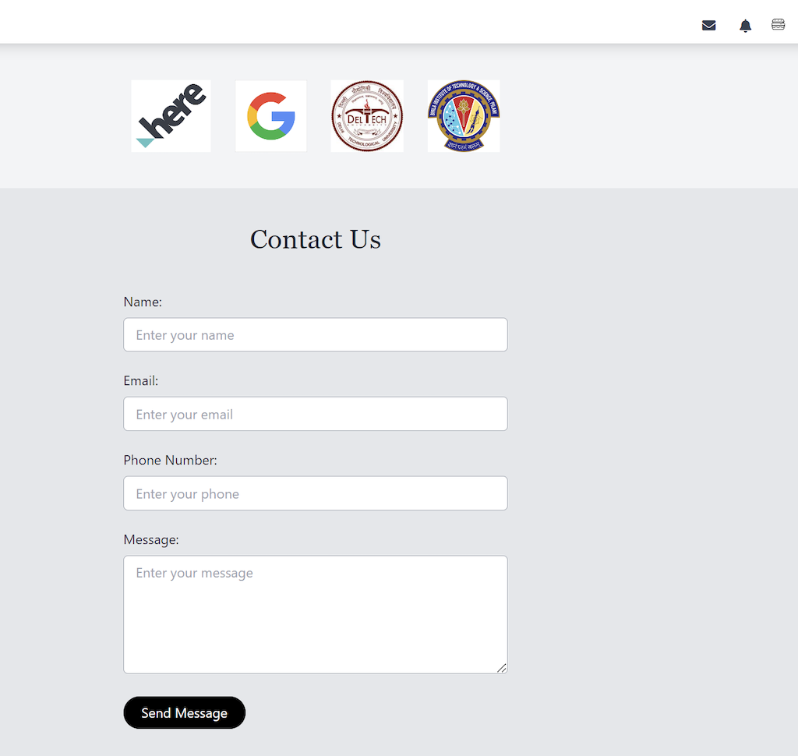

# Efficient Food Delivery System

### Website : https://hungryhere.aimsdtu.live/

Welcome to our highly efficient, user-friendly, and sustainable food delivery system! This system is designed to optimize delivery routes for restaurants and food outlets, ensuring timely and fuel-efficient delivery of food items to customers.

## Features

- **Efficient Route Optimization:** Our system utilizes advanced algorithms to find the most time and fuel-efficient routes for delivering food items from restaurants to customers.
- **Customized User Experience:** We offer a customized and exclusive experience for both restaurants and customers through our website.
- **Authentication Portal:** Secure login functionality ensures access control for restaurants and customers.
- **Location Setting:** Restaurants can easily set the delivery location using HERE's autosuggestion API, ensuring accurate delivery without hassle.
- **Route Selection Algorithm:** Our backend algorithm, powered by HERE's routing API, identifies multiple routes from the source (restaurant) to the destination (customer). It considers various factors like vehicle type, traffic conditions, and distance to determine the most appropriate and efficient route.
- **Interactive Mapping:** The final optimized routes are visually rendered on the frontend website using Mapping API, enabling riders to navigate and deliver food efficiently.
- **Custom Chatbot:** Our landing page features a custom chatbot designed to guide and attract new users, providing information about the platform's features and benefits.

## Technologies Used

- Backend: Flask
- Frontend: HTML, CSS, JavaScript, TailwindCSS
- APIs: HERE Autosuggestion API, HERE Routing API, Mapping API
- Other: Authentication, Chatbot Integration

## Description

Here's a glimpse of our food delivery system in action:

### Routing Process
Our backend algorithm intelligently selects the most efficient routes for food delivery, ensuring timely service and minimal fuel consumption.

### Landing Page
Our landing page provides a seamless user experience, showcasing our services and encouraging users to explore further.

### Contact Us Page
Need assistance or have questions? Our contact us page is here to help you get in touch with our support team.

## Getting Started

## Contributors

- Aditya Raj Kashyap (@AdityaRaj23)
- Ishan Chugh (@Ishan-Deepsolv)
- Shuddhabrota Banerjee (@shuban2204)
- Shashvat Singhal (@Shashvat-bbx)

